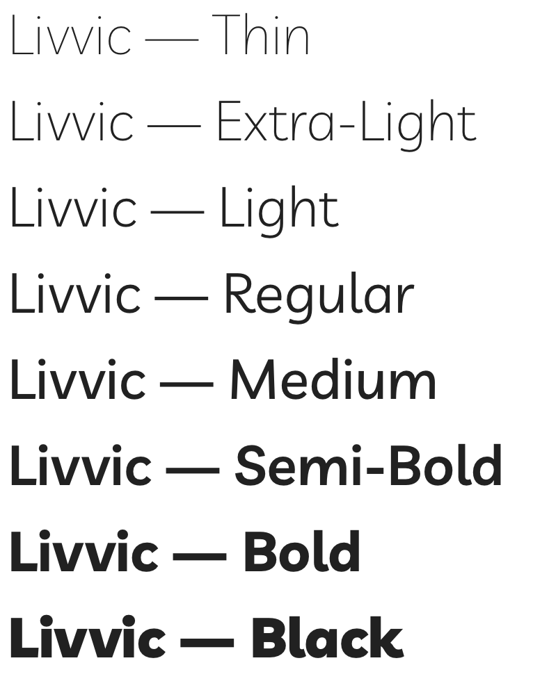
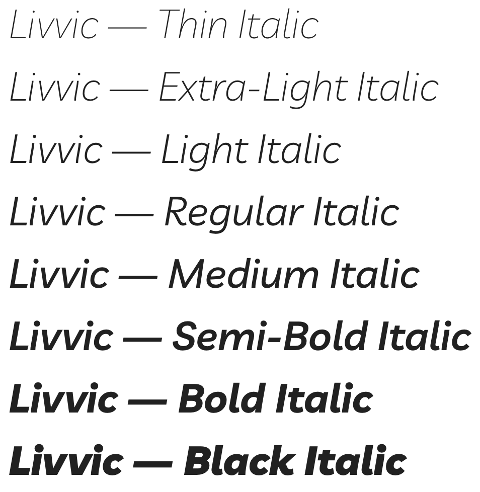

# Livvic Font Family

Livvic is a custom corporate typeface designed by Jacques Le Bailly for LV= (Liverpool Victoria Friendly Society Limited), an insurance company based in the UK.
The typeface is part of a brand redesign.

Livvic was designed to capture LV=’s brand values and uniqueness.
It is an open, friendly and somewhat quirky design.
Corporate, yet still fresh and personal.

The Roman is an upright Italic, with some inspirations from handwriting.
This gives livvic a strong, yet accessible character.

The Italic has matching metrics to the Roman. Although the Italic and Roman share a lot of similarities, the construction is different.
It is gives the Italic some more panache.

To contribute, see [github.com/Fonthausen/Livvic](https://github.com/Fonthausen/Livvic)

## License

These fonts are available under the SIL Open Font License.
See [OFL.txt](OFL.txt) for details.
